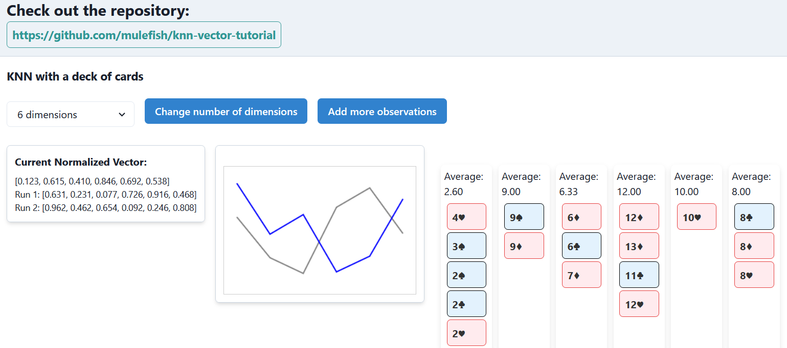

# Repo
https://github.com/mulefish/knn-vector-tutorial

# Goal
1: Show how to 'pick' random paths using a cards   
2: Show how to vectorize those paths   
3: Show how to compare those vectors   
4: Discuss why that is nice  
5: First using 'cards' and next use a slightly less simple dataset with more dimensions to show how powerful vecoriztion is   

# COPY
An Introduction to KNN: On Comparing Apples and Oranges and Machine Learning and Vectors  
  
You can’t compare apples and oranges, they say. But let me tell you something: you absolutely can. You just need to know where to look. The secret is, it’s all about finding the right dimensions.  
  
See, most of us go through life assuming things are different, that they have nothing to do with each other. But when you start paying attention, you find out that everything shares a little something. Apples and oranges? Sure, they look different, taste different, grow on different trees, but if you look closer, you’ll see they’re both just data waiting to be understood. I mean, I’m no expert on fruit, but they’re not as far apart as you think.  
  
Here’s what you do: you take all the little details—the weight, the skin thickness, the color, maybe even the season they ripen in—and you put all that into a space. A bigger space. You start to notice patterns. Apples and oranges aren’t two things—they’re just points on a map, a map with more dimensions than you and I are used to thinking about.  
  
And once you’ve got them in that space, that’s when the magic happens. Because suddenly, you can compare them. You can measure how close they are to each other, not just as fruits, but as data. You’re not comparing apples and oranges anymore. You’re comparing numbers, distances, relationships. And that, my friend, is what KNN is all about.  
  
Now, let’s talk about this little React app I’ve been working on. It’s a toy model of KNN, but instead of apples and oranges, we’re working with a deck of cards. Here’s how it goes:  
  
First, we start by picking N cards from the deck, one for each column—our “dimensions,” if you will. These cards give us our initial space to work with, just like laying down that first map.  
  
Then, we draw another N cards, one by one, and place them in whichever “bucket” is closest in value. It’s like finding where that card fits best in our little universe, which dimension it belongs to. And we keep doing this, card by card, until the deck is completely empty.  
  
By the time we’re done, we’ve created something called a “run” vector, a string of numbers that tells us how the cards were distributed across those dimensions, in a Machine Learniing friendly manner.    
  
And there it is—a playful little dance of data, a tiny universe of cards falling into place, each one finding its home. It’s a simple way to show how KNN takes something that looks like chaos and finds the hidden structure. It’s all about figuring out where things fit, how they’re more alike than you’d ever think, and turning that understanding into something useful. You got this.  

# Screenshot

# TODO
DISCUSSION with words! Compare Apples and Oranges!
